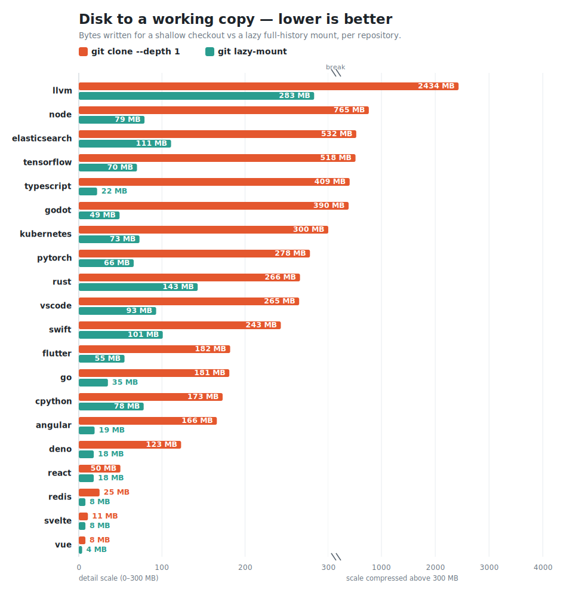
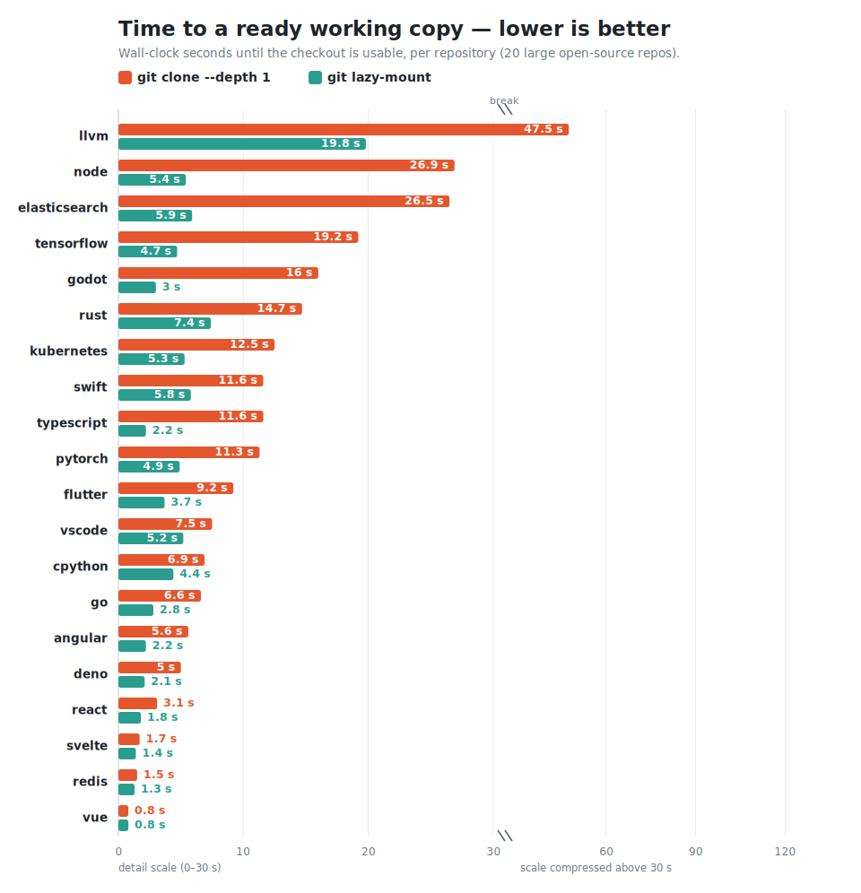

# Real-world benchmarks

How the numbers in the project [README](../README.md#performance-in-real-world)
were measured, with full agent transcripts.

## What is measured

Two benchmarks, run cold on the current upstream repos:

- **[20 repositories](#across-20-repositories)** — disk and time to get a working
  copy: a full `git clone` vs `git lazy-mount`, each in its own **Firecracker
  microVM** (KVM, `/dev/fuse`).
- **[3-repo deep dive](#results-deep-dive--3-repos)** — the full workflow in a
  `/dev/fuse` container: a real `claude` (Sonnet) prompt finds where some code
  lives, edits it, then **commits + pushes through the mount**. Code search goes
  through [`sgrep`](../crates/sgrep) (a cloud index, **zero** local reads), so the
  agent materializes only the file it edits.

## Across 20 repositories

`git lazy-mount` vs `git clone` for 20 well-known repositories (703–179,000 files,
across JS/TS, Go, Rust, C/C++, Python, Dart, Java) — each measured cold in **its own
Firecracker microVM** (KVM, `/dev/fuse`), comparing the disk and time to get a
working copy.





Checking out all 20 with full history costs **23 GB via `git clone`** vs **1.3 GB
of lazy mounts — 18× less** — and each mount is ready in **1–22 s**, even the
179k-file LLVM tree (the working-tree walk is served from the in-process tree cache
rather than re-read per directory, so it no longer scales with file count).

| repo | files | full `git clone` | `git lazy-mount` | mount |
|---|---:|---:|---:|---:|
| [llvm/llvm-project](https://github.com/llvm/llvm-project) | 179,153 | 4,160 MB | **283 MB** | 19 s |
| [microsoft/TypeScript](https://github.com/microsoft/TypeScript) | 81,369 | 2,891 MB | **22 MB** | 2 s |
| [godotengine/godot](https://github.com/godotengine/godot) | 14,024 | 1,803 MB | **49 MB** | 22 s |
| [elastic/elasticsearch](https://github.com/elastic/elasticsearch) | 44,314 | 1,635 MB | **111 MB** | 7 s |
| [nodejs/node](https://github.com/nodejs/node) | 49,407 | 1,468 MB | **79 MB** | 6 s |
| [kubernetes/kubernetes](https://github.com/kubernetes/kubernetes) | 30,519 | 1,449 MB | **73 MB** | 12 s |
| [pytorch/pytorch](https://github.com/pytorch/pytorch) | 21,434 | 1,414 MB | **66 MB** | 6 s |
| [apple/swift](https://github.com/apple/swift) | 31,564 | 1,321 MB | **101 MB** | 21 s |
| [tensorflow/tensorflow](https://github.com/tensorflow/tensorflow) | 36,489 | 1,308 MB | **70 MB** | 5 s |
| [microsoft/vscode](https://github.com/microsoft/vscode) | 16,031 | 1,273 MB | **93 MB** | 6 s |
| [facebook/react](https://github.com/facebook/react) | 7,243 | 977 MB | **18 MB** | 2 s |
| [rust-lang/rust](https://github.com/rust-lang/rust) | 60,549 | 906 MB | **143 MB** | 12 s |
| [python/cpython](https://github.com/python/cpython) | 5,829 | 819 MB | **78 MB** | 5 s |
| [angular/angular](https://github.com/angular/angular) | 10,605 | 629 MB | **19 MB** | 6 s |
| [flutter/flutter](https://github.com/flutter/flutter) | 16,021 | 438 MB | **55 MB** | 5 s |
| [golang/go](https://github.com/golang/go) | 15,596 | 433 MB | **35 MB** | 3 s |
| [denoland/deno](https://github.com/denoland/deno) | 14,300 | 233 MB | **18 MB** | 6 s |
| [redis/redis](https://github.com/redis/redis) | 1,818 | 209 MB | **8 MB** | 22 s |
| [sveltejs/svelte](https://github.com/sveltejs/svelte) | 8,944 | 118 MB | **8 MB** | 9 s |
| [vuejs/core](https://github.com/vuejs/core) | 703 | 42 MB | **4 MB** | 1 s |

`git clone` is the **full** clone download (the repo's reported size — the
apples-to-apples baseline, since lazy-mount keeps full history too); `git
lazy-mount` is the on-disk workspace right after mounting. The time chart compares
against `git clone --depth 1` (the *fastest* clone, which drops history); a full
clone takes far longer. Each repo runs cold in a fresh Firecracker microVM on a KVM
host (the harness is in [`firecracker/`](firecracker/)); the 3-repo deep dive below
adds the full `sgrep`-driven agent task.

## Results (deep dive — 3 repos)

| repo | files | `git clone --depth 1` | `git lazy-mount` | file content fetched |
|---|---|---|---|---|
| facebook/react | 7,243 | 53 MB | 18 MB → 36 MB | 3 MB |
| microsoft/vscode | 16,018 | 278 MB | 97 MB → 159 MB | 1 MB |
| microsoft/TypeScript | 81,369 | 429 MB | 23 MB → 82 MB | 9 MB |

`git lazy-mount` is the on-disk workspace **right after mounting → after the agent
finished**. It keeps the **full commit history** (the clone is shallow) yet starts
smaller than even a shallow clone. Of the lazy footprint, only **1–9 MB** is actual
file *content* (sgrep answers the search; the agent reads just the one file it
edits) — the rest is the `tree:0` commit history, plus the trees Git faults while
building and pushing the commit (the mount→after-task growth). A full `git clone`
with the same history is an order of magnitude larger (see the table above) — what
lazy-mount avoids.

All six runs completed end to end, including the lazy runs on the 16k-file vscode
and the 81k-file TypeScript trees — each agent searched, edited, committed, and
**pushed** a branch through the mount.

### Session total time (setup + a real task) — honest, workload-dependent

Disk and setup are unambiguous wins, but the **total** wall-clock of a session
(set up, then run a real `claude` task: find code with sgrep, edit one file,
commit) is **workload-dependent**. Measured across all 20 repos (Docker, `/dev/fuse`,
current upstreams), lazy-mount wins total time on **9 of 20**, and the split is not
random — it tracks how expensive the clone is versus how much the lazy *task* costs:

- **Lazy-mount wins** where the clone is expensive enough that the instant mount
  offsets the task: e.g. `swift` 472 → **162 s**, `llvm` 390 → **307 s**,
  `elasticsearch` 162 → **94 s**, plus `pytorch`, `rust`, `cpython`, `go`, `svelte`,
  `react`.
- **Lazy-mount loses** on (a) small, fast-to-clone repos where a from-scratch clone
  finishes in seconds (`vue`, `deno`, `redis`), and (b) a few large *working trees*
  where, during `git commit`, git faults trees/blobs on demand through FUSE
  (`typescript`, `node`, `vscode`, `tensorflow`) — the instant mount doesn't offset
  that.

So the honest takeaway: **lazy-mount's reliable wins are disk (18×) and instant
setup**; it also wins total time when clone cost is high, and the remaining loss is
the on-demand **commit fault** — git materializing the objects it needs to build the
commit. Driving that to a clone-like ~0.1 s is the open work that would make the
total-time win general.

## Transcripts

Full `claude` session transcripts (every tool call + result, with `[+Ns]` time
offsets from the start):

- [`transcripts/react-full.md`](transcripts/react-full.md) · [`react-lazy.md`](transcripts/react-lazy.md)
- [`transcripts/vscode-full.md`](transcripts/vscode-full.md) · [`vscode-lazy.md`](transcripts/vscode-lazy.md)
- [`transcripts/typescript-full.md`](transcripts/typescript-full.md) · [`typescript-lazy.md`](transcripts/typescript-lazy.md)

## Reproduce

```bash
cd benchmarks
docker build -t glm-bench .                 # ubuntu + rust + git-lazy-mount + sgrep + claude (non-root)
printf 'ANTHROPIC_API_KEY=...\nGH_TOKEN=...\n' > .benchenv && chmod 600 .benchenv
./run.sh react  facebook/react  <your-fork>/react  facebook/react  main  'where does `useState` resolve its initial state?'
```

See [`bench_repo.sh`](bench_repo.sh) for the per-repo driver and [`run.sh`](run.sh)
for launching one. The image runs as a non-root user so `claude` can run headlessly
with a scoped tool allow-list; FUSE works via `--device /dev/fuse --cap-add SYS_ADMIN`.
