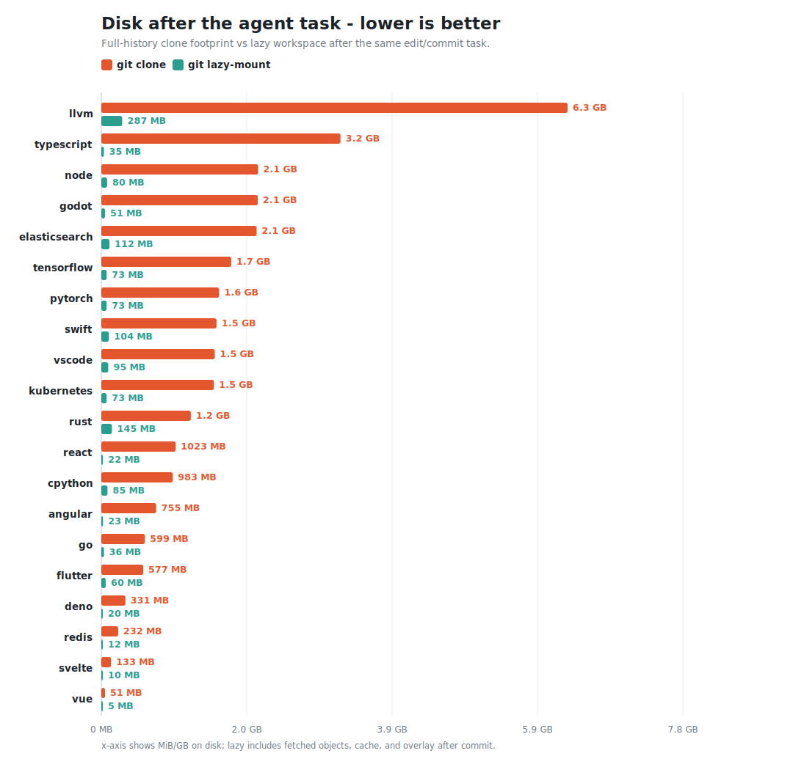

# Real-world benchmarks

How the numbers in the project [README](../README.md#performance-in-real-world)
were measured, with full agent transcripts.

## What is measured

Three benchmarks, run cold on the current upstream repos:

- **[20 repositories](#across-20-repositories)** — disk and time to get a working
  copy: a shallow `git clone` vs `git lazy-mount`, each in its own **Firecracker
  microVM** (KVM, `/dev/fuse`).
- **[20-repo agent task](#session-total-time-setup--a-real-task)** — the full
  workflow in Firecracker: a real `claude` (Sonnet) prompt finds where some code
  lives, edits it, then commits through either a full clone or the lazy mount.
  Code search goes through [`sgrep`](../crates/sgrep) (a cloud index, **zero**
  local reads), so the agent materializes only the files it actually reads/edits.
- **[3-repo transcript deep dive](#results-deep-dive--3-repos)** — an older
  Docker run with full transcripts for React, VS Code, and TypeScript. Search goes
  through [`sgrep`](../crates/sgrep) (a cloud index, **zero** local reads), so the
  agent materializes only the file it edits.

## Across 20 repositories

`git lazy-mount` vs `git clone` for 20 well-known repositories (703–179,000 files,
across JS/TS, Go, Rust, C/C++, Python, Dart, Java) — each measured cold in **its own
Firecracker microVM** (KVM, `/dev/fuse`), comparing the disk and time to get a
working copy.


Checking out all 20 with `git clone --depth 1` costs **7.3 GB** vs **1.3 GB
of lazy mounts — 5.5× less**. Ready time totals **268.7 s** for shallow clone vs
**88.7 s** for lazy-mount, so lazy is **3.0× faster** in this setup benchmark.
Each lazy mount is ready in **0.8–15.1 s**, even the 179k-file LLVM tree.

| repo | files | shallow `git clone` | `git lazy-mount` | mount |
|---|---:|---:|---:|---:|
| [llvm/llvm-project](https://github.com/llvm/llvm-project) | 179,197 | 2,434 MB | **284 MB** | 15.1 s |
| [nodejs/node](https://github.com/nodejs/node) | 49,410 | 765 MB | **79 MB** | 5.4 s |
| [elastic/elasticsearch](https://github.com/elastic/elasticsearch) | 44,326 | 532 MB | **111 MB** | 6.4 s |
| [tensorflow/tensorflow](https://github.com/tensorflow/tensorflow) | 36,509 | 519 MB | **70 MB** | 4.8 s |
| [microsoft/TypeScript](https://github.com/microsoft/TypeScript) | 81,369 | 409 MB | **22 MB** | 2.2 s |
| [godotengine/godot](https://github.com/godotengine/godot) | 14,024 | 390 MB | **49 MB** | 2.9 s |
| [kubernetes/kubernetes](https://github.com/kubernetes/kubernetes) | 30,519 | 300 MB | **73 MB** | 5.6 s |
| [pytorch/pytorch](https://github.com/pytorch/pytorch) | 21,433 | 278 MB | **66 MB** | 5.7 s |
| [rust-lang/rust](https://github.com/rust-lang/rust) | 60,654 | 266 MB | **143 MB** | 7.7 s |
| [microsoft/vscode](https://github.com/microsoft/vscode) | 16,040 | 265 MB | **93 MB** | 5.5 s |
| [apple/swift](https://github.com/apple/swift) | 31,564 | 243 MB | **101 MB** | 5.7 s |
| [flutter/flutter](https://github.com/flutter/flutter) | 16,022 | 182 MB | **55 MB** | 3.8 s |
| [golang/go](https://github.com/golang/go) | 15,596 | 181 MB | **35 MB** | 3.2 s |
| [python/cpython](https://github.com/python/cpython) | 5,860 | 173 MB | **78 MB** | 4.8 s |
| [angular/angular](https://github.com/angular/angular) | 10,605 | 166 MB | **19 MB** | 2.2 s |
| [denoland/deno](https://github.com/denoland/deno) | 14,309 | 123 MB | **18 MB** | 2.3 s |
| [facebook/react](https://github.com/facebook/react) | 7,243 | 50 MB | **18 MB** | 1.8 s |
| [redis/redis](https://github.com/redis/redis) | 1,818 | 25 MB | **8 MB** | 1.4 s |
| [sveltejs/svelte](https://github.com/sveltejs/svelte) | 8,944 | 11 MB | **8 MB** | 1.4 s |
| [vuejs/core](https://github.com/vuejs/core) | 703 | 8 MB | **4 MB** | 0.8 s |

`git clone --depth 1` is the fastest ordinary clone baseline and drops history;
`git lazy-mount` keeps full commit history via a `tree:0` partial clone and
materializes file contents on demand. Each repo runs cold in a fresh Firecracker
microVM on a KVM host (the harness is in [`firecracker/`](firecracker/)); the
full-agent benchmark below adds the `sgrep`-driven edit/commit task.

## Results (deep dive — 3 repos)

| repo | files | `git clone --depth 1` | `git lazy-mount` | file content fetched |
|---|---|---|---|---|
| facebook/react | 7,243 | 53 MB | 18 MB → 36 MB | 3 MB |
| microsoft/vscode | 16,018 | 278 MB | 97 MB → 159 MB | 1 MB |
| microsoft/TypeScript | 81,369 | 429 MB | 23 MB → 82 MB | 9 MB |

`git lazy-mount` is the on-disk workspace **right after mounting → after the agent
finished**. It keeps the **full commit history** (the clone is shallow) yet starts
smaller than even a shallow clone. Of the lazy footprint, only **1–9 MB** is actual
file *content* (sgrep answers the search; the agent reads just the one file it
edits) — the rest is the `tree:0` commit history, plus the trees Git faults while
building and pushing the commit (the mount→after-task growth). A full `git clone`
with the same history is an order of magnitude larger (see the table above) — what
lazy-mount avoids.

All six runs completed end to end, including the lazy runs on the 16k-file vscode
and the 81k-file TypeScript trees — each agent searched, edited, committed, and
**pushed** a branch through the mount.

### Session total time (setup + a real task)

The full-agent benchmark runs the same `sgrep`-driven code-search/edit/commit task
twice per repo in a fresh Firecracker microVM: once after a full-history
`git clone`, once after `git lazy-mount`.




Across all 20 repos, lazy-mount won **20 of 20** total sessions. Full clone+agent
time totaled **2861.1 s** vs **977.5 s** for lazy mount+agent, saving
**1883.6 s** overall (**2.93× faster**). The setup split is the main driver:
full clone time totaled **1861.6 s** vs **82.8 s** for lazy mounts. The agent
phases were comparable in aggregate: **999.5 s** on full clones vs **894.7 s**
on lazy mounts.

The narrowest win was `svelte`: full clone+agent took **18.7 s** and lazy
mount+agent took **16.5 s**. The largest wins were `llvm` (**357.7 s saved**)
and `typescript` (**198.5 s saved**).

Disk after the completed task was **30.2 GB** for full-history clones vs **1.4 GB**
for lazy workspaces (**21.5× smaller**). This is a full-history clone baseline;
the setup chart above intentionally uses a shallower, faster clone baseline.

## Transcripts

Full `claude` session transcripts (every tool call + result, with `[+Ns]` time
offsets from the start):

- [`transcripts/react-full.md`](transcripts/react-full.md) · [`react-lazy.md`](transcripts/react-lazy.md)
- [`transcripts/vscode-full.md`](transcripts/vscode-full.md) · [`vscode-lazy.md`](transcripts/vscode-lazy.md)
- [`transcripts/typescript-full.md`](transcripts/typescript-full.md) · [`typescript-lazy.md`](transcripts/typescript-lazy.md)

For current full-run analysis, generate compact timing summaries from raw
`*.transcript.tsv` files:

```bash
python3 benchmarks/format_transcripts.py benchmarks/out/<docker-run-id>
python3 benchmarks/format_transcripts.py benchmarks/out/<firecracker-run-id>/run
```

This writes `transcripts-summary/SUMMARY.md`, `summary.csv`, and one concise
Markdown file per transcript without copying large file payloads from tool
results.

## Reproduce

```bash
docker build -t glm-bench -f benchmarks/Dockerfile .  # local checkout + claude (non-root)
printf 'ANTHROPIC_API_KEY=...\n' > benchmarks/.benchenv && chmod 600 benchmarks/.benchenv
benchmarks/run.sh react  facebook/react  <your-fork>/react  facebook/react  main  'where does `useState` resolve its initial state?'
```

`run.sh` commits locally by default, even when `.benchenv` contains `GH_TOKEN`.
Pass `--push` only when you intentionally want benchmark branches pushed to the
fork argument.

To run the full 20-repo agent benchmark locally in Docker and keep transcript
summaries current after each repo:

```bash
benchmarks/run_all.sh --run-id agent-full
```

The Docker agent benchmark sets `SGREP_BROAD_TIMEOUT_SECS=12` by default so one
unfiltered remote search cannot dominate a cheap repo. Pass
`--sgrep-broad-timeout 0` to disable that cap for comparison runs.
For experiments that should cap every remote search, pass `--sgrep-timeout N`;
leave it unset or `0` for the provider default on file-filtered searches.

See [`bench_repo.sh`](bench_repo.sh) for the per-repo driver, [`run.sh`](run.sh)
for launching one repo, and [`run_all.sh`](run_all.sh) for the 20-repo batch. The
image runs as a non-root user so `claude` can run headlessly with a scoped tool
allow-list; FUSE works via `--device /dev/fuse --cap-add SYS_ADMIN`.
